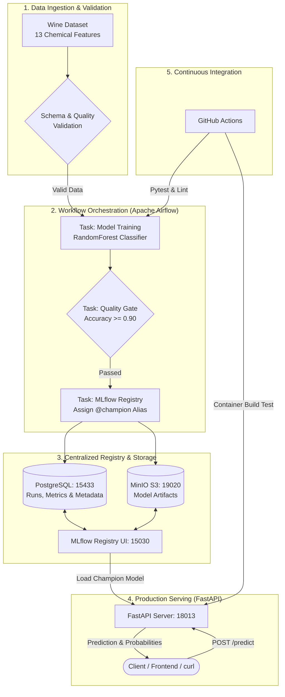

# 🍷 Automated MLOps Pipeline: From Ingestion to Serving

[](https://github.com/ZgsNat/mlops-exercise/actions/workflows/ci.yml)
[](https://github.com/astral-sh/uv)
[](https://www.python.org/)
[](https://airflow.apache.org/)
[](https://mlflow.org/)
[](https://fastapi.tiangolo.com/)
[](https://www.docker.com/)

> **DDM501 — AI in DevOps, DataOps, MLOps · Capstone Project**  
> An end-to-end, production-grade implementation of the **first half of the continuous MLOps lifecycle**: automated data validation, scheduled training pipeline with quality gating, model registry versioning, and real-time API serving.

---

## 📖 Project Overview

In traditional machine learning tutorials, models are manually trained in Jupyter Notebooks, saved as static `.pkl` files on disk, and loaded directly by web servers. This approach fails rapidly in production environments where models degrade over time and deployments must be automated, reproducible, and verifiable.

This project implements a **robust, automated MLOps pipeline** using scikit-learn's **Wine Recognition Dataset** (13 chemical continuous features, 3 wine cultivar classes). 

### What This Project Delivers (The Foundational Half):
1. **Automated Orchestration (Apache Airflow)**: A DAG that automatically validates incoming data, orchestrates training, evaluates metrics against a strict quality gate, and registers qualifying models.
2. **Enterprise Tracking & Model Registry (MLflow)**: Decoupled metadata tracking (in PostgreSQL) and object storage (in MinIO S3), keeping model versions auditable and reproducible.
3. **Registry-Driven Model Serving (FastAPI)**: A lightweight inference microservice that fetches models directly from the MLflow Model Registry via S3 protocol without storing static weights inside the image.
4. **Automated Quality & CI/CD (GitHub Actions)**: Automated code linting, unit testing, and container build checks on every push.

---

## 🏗 System Architecture



---

## ⚙️ Service Ports & Endpoints

All services run cleanly isolated in Docker with non-conflicting dedicated ports:

| Service | Port | Description | Default Credentials |
| :--- | :--- | :--- | :--- |
| **Apache Airflow** | `http://localhost:18080` | DAG Workflow Orchestration UI | `admin` / `admin` |
| **MLflow Server** | `http://localhost:15030` | Experiment Tracking & Model Registry | None (Public) |
| **MinIO Console** | `http://localhost:19021` | S3 Object Storage Web Browser | `minioadmin` / `miniopassword` |
| **MinIO API** | `http://localhost:19020` | S3 API Endpoint for MLflow/API | — |
| **FastAPI Serving** | `http://localhost:18013` | Model Inference & Healthcheck API | — |
| **FastAPI Swagger** | `http://localhost:18013/docs` | Interactive OpenAPI Documentation | — |
| **PostgreSQL** | `localhost:15433` | Shared Metadata Store (`mlops_db`, `airflow_db`) | `mlops` / `mlopspass` |

---

## 🚀 Quickstart Guide

### 1. Prerequisites
- Docker and Docker Compose (v2.0+) installed.
- (Optional for local testing) Python 3.11+.

### 2. Clone & Setup Environment
```bash
# Clone the repository
git clone https://github.com/ZgsNat/mlops-exercise.git
cd mlops-exercise

# Copy environment settings template (defaults work out-of-the-box)
cp .env.example .env
```

### 3. Start the Entire Stack
Spin up PostgreSQL, MinIO, MLflow, Airflow, and FastAPI with a single command:

```bash
docker compose up -d --build
```

Check the health of all containers:
```bash
docker compose ps
```
> ⏳ **Tip**: Wait approximately 30–45 seconds for PostgreSQL and MinIO to finish self-initialization. Once `mlops-postgres` and `mlops-mlflow` report `healthy`, all services are ready.

---

## 🔄 Running the Pipeline

### Step 1: Trigger the Airflow DAG
The Airflow DAG coordinates the entire training-to-registration lifecycle.

You can trigger it via the **Airflow Web UI**:
1. Open [http://localhost:18080](http://localhost:18080) and log in with `admin` / `admin`.
2. Locate the DAG: **`wine_model_training_pipeline`**.
3. Toggle the DAG switch to **Active**, then click the **▶️ Trigger DAG** button.

Or trigger it instantly via terminal:
```bash
docker compose exec airflow airflow dags trigger wine_model_training_pipeline
```

### Step 2: Observe Task Execution
The DAG executes 4 sequential tasks:
1. `validate_dataset`: Verifies the Wine dataset schema (13 features, no nulls, 3 target classes).
2. `train_model`: Trains a Random Forest pipeline (`StandardScaler` + `RandomForestClassifier`), logging parameters, metrics, signature, and artifacts to MLflow.
3. `evaluate_and_register`: Enforces the quality gate (Accuracy $\ge 0.90$). Upon success, automatically registers `wine-classifier` version 1 into the MLflow Model Registry and tags it with alias `@champion`.
4. `verify_pipeline`: Verifies that the newly registered version is queryable by downstream services.

---

## 🔍 Inspecting Tracking & Artifacts

### 1. View Experiment & Model in MLflow
Open [http://localhost:15030](http://localhost:15030):
- **Experiments tab**: Inspect `wine-classification-pipeline` to see logged hyperparameters (`n_estimators`, `max_depth`) and metrics (`accuracy` $\approx 0.97$, `f1_macro`).
- **Models tab**: Click on **`wine-classifier`** to see Version 1 with the `@champion` alias and model signature.

### 2. View Artifacts in MinIO (S3 Object Storage)
Open [http://localhost:19021](http://localhost:19021) and log in (`minioadmin` / `miniopassword`):
- Click on the **`mlflow`** bucket.
- Browse to the run artifacts: you will find the binary `model.pkl`, `conda.yaml`, and `MLmodel` metadata stored natively in S3!

---

## 🔮 Serving & Making Real-Time Predictions

The FastAPI service reads directly from the MLflow Model Registry.

### 1. Healthcheck Endpoint
```bash
curl -s http://localhost:18013/health | jq .
```
Expected output:
```json
{
  "status": "ok",
  "model_loaded": true,
  "model_uri": "models:/wine-classifier/1",
  "classes": ["class_0", "class_1", "class_2"]
}
```

### 2. Run a Sample Prediction
Run the provided helper script:
```bash
python scripts/sample_predict.py
```

Or send an HTTP POST request directly using `curl`:
```bash
curl -s -X POST http://localhost:18013/predict \
  -H 'Content-Type: application/json' \
  -d '{
    "alcohol": 14.23,
    "malic_acid": 1.71,
    "ash": 2.43,
    "alcalinity_of_ash": 15.6,
    "magnesium": 127.0,
    "total_phenols": 2.8,
    "flavanoids": 3.06,
    "nonflavanoid_phenols": 0.28,
    "proanthocyanins": 2.29,
    "color_intensity": 5.64,
    "hue": 1.04,
    "od280/od315_of_diluted_wines": 3.92,
    "proline": 1065.0
  }' | jq .
```

Response:
```json
{
  "predicted_class": "class_0",
  "class_id": 0,
  "probabilities": {
    "class_0": 0.98,
    "class_1": 0.02,
    "class_2": 0.0
  },
  "served_by": "models:/wine-classifier/1"
}
```

---

## 🧪 Testing & CI/CD Pipeline

Continuous Integration is implemented via **GitHub Actions** in [`.github/workflows/ci.yml`](.github/workflows/ci.yml):

1. **Linting (`flake8`, `black`)**: Enforces code style, PEP 8 compliance, and prevents syntax errors.
2. **Automated Unit Tests (`pytest`)**:
   - `test_data.py`: Validates dataset extraction, feature dimension integrity, and error raising on corrupt data.
   - `test_train.py`: Validates end-to-end training and metric generation using an isolated temporary MLflow SQLite instance.
   - `test_api.py`: Validates FastAPI routing, `/health` contract, and handling of uninitialized models.
3. **Docker Build Check**: Verifies that the unified Docker image compiles cleanly without layer breaks.

Run the tests and linting locally using `uv`:
```bash
# Sync dependencies in seconds with uv
uv sync --dev

# Run full pytest suite with test coverage
uv run pytest -v tests/ --cov=src

# Run code style & lint check
uv run flake8 src app tests
```

---

## 🔮 Roadmap: Completing the MLOps Lifecycle (The Second Half)

This project completes the **Ingestion &rarr; Orchestration &rarr; Registry &rarr; Serving** half of the MLOps lifecycle. In a full continuous production loop, the remaining half includes:

```
[FastAPI Serving]
       │
       ▼ (Predict Logs)
[Prometheus / OpenTelemetry] ──> [Grafana Dashboard] (Latency, Requests, Error Rate)
       │
       ▼ (Feature & Prediction Logs)
[Evidently AI] (Data Drift & Concept Drift Detection)
       │
       ▼ (If Drift Detected)
[Webhook Trigger] ──> Retrigger Airflow DAG (Retrain on fresh data)
```

1. **Prometheus & Grafana**: Scraping real-time serving metrics (RPS, latency percentiles, memory).
2. **Evidently AI**: Monitoring statistical distribution drift between training features and live inference requests.
3. **Automated Feedback Loop**: Alerting Airflow via Webhook/API to automatically retrain the model when data drift exceeds thresholds.

---

## 🧹 Teardown

To shut down all services and free system resources:
```bash
docker compose down
```
*(All metadata in PostgreSQL and artifacts in MinIO are persisted in `./pg-data` and `./minio-data`)*.

---

## 👨‍💻 Author
- **Course**: DDM501 — AI in DevOps, DataOps, MLOps
- **Institution**: FSB, FPT University
